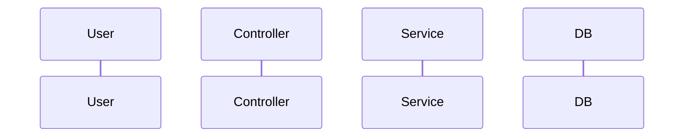
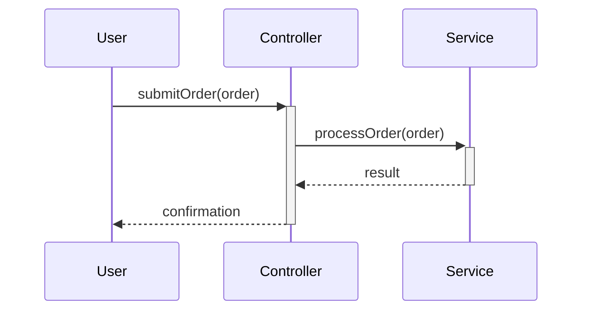
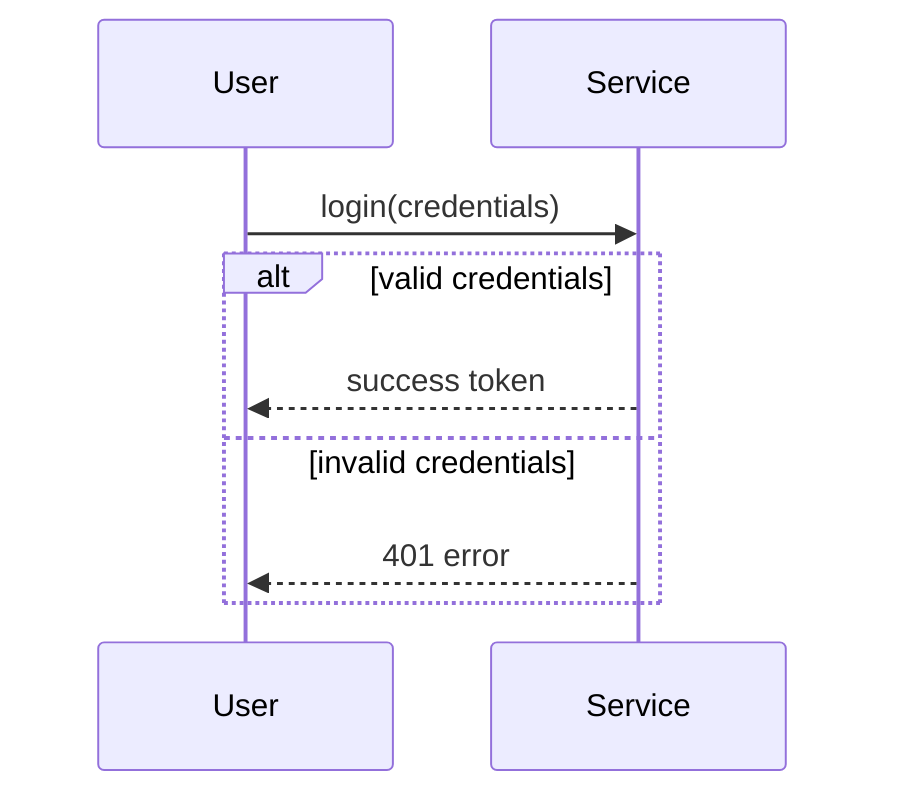
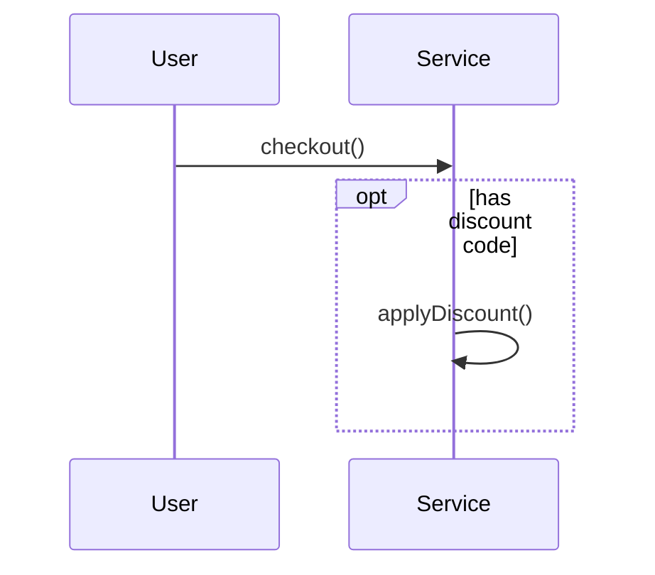
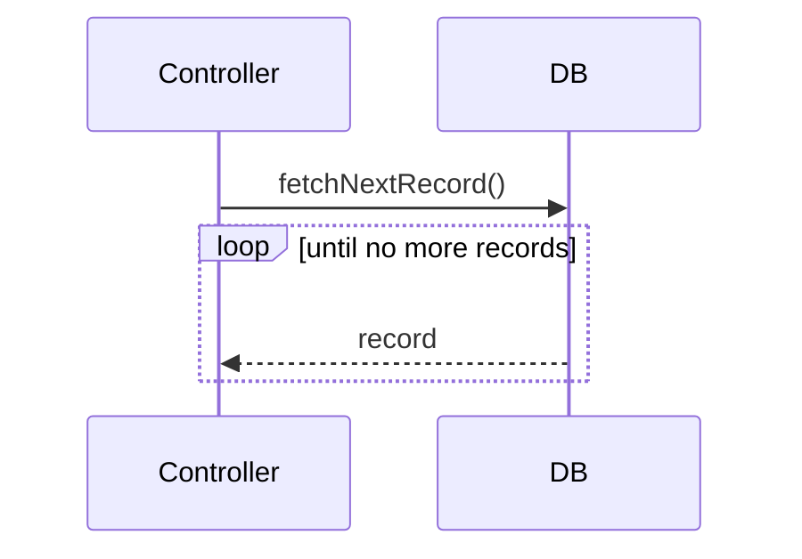
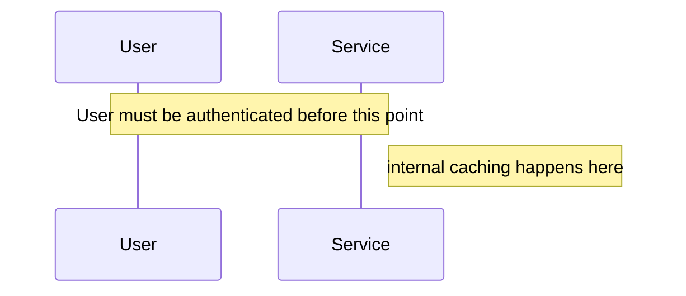
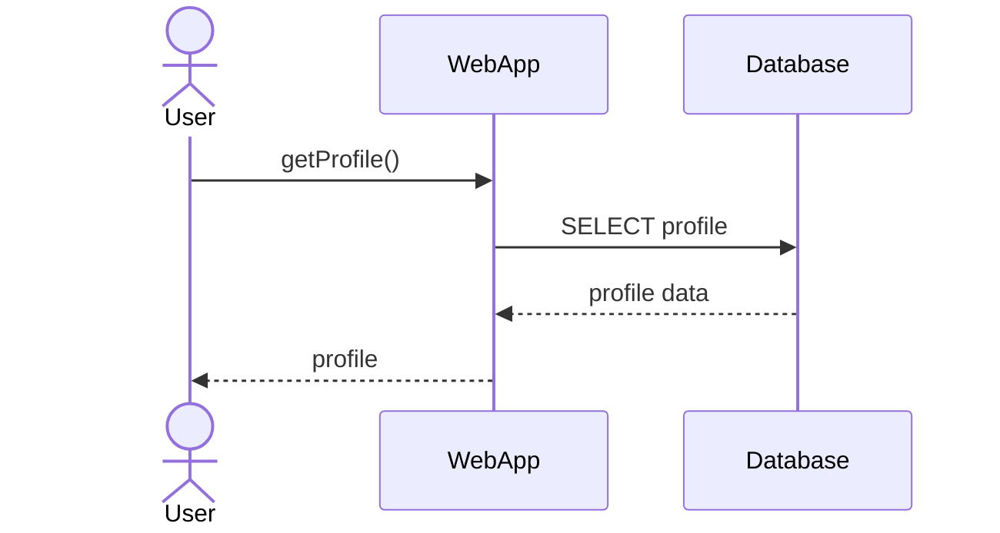
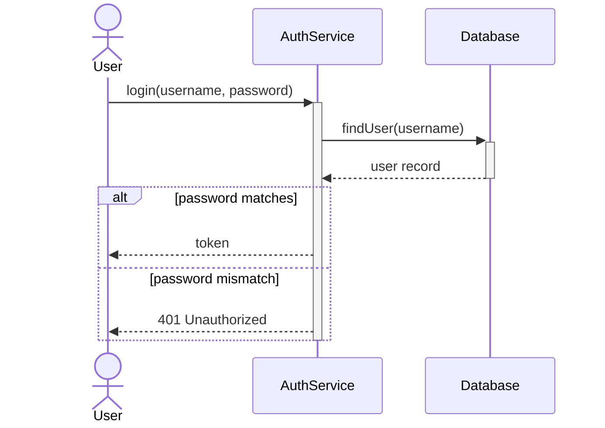
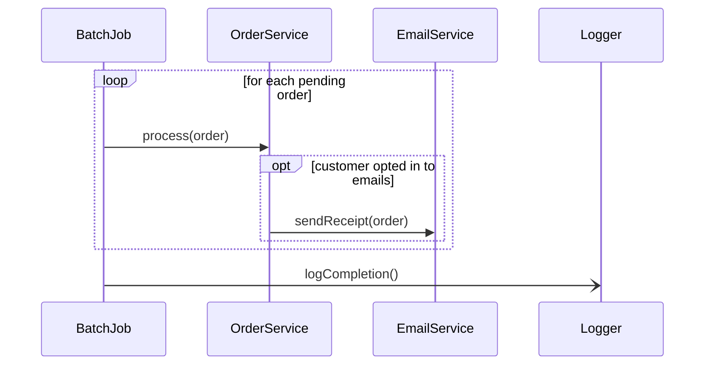
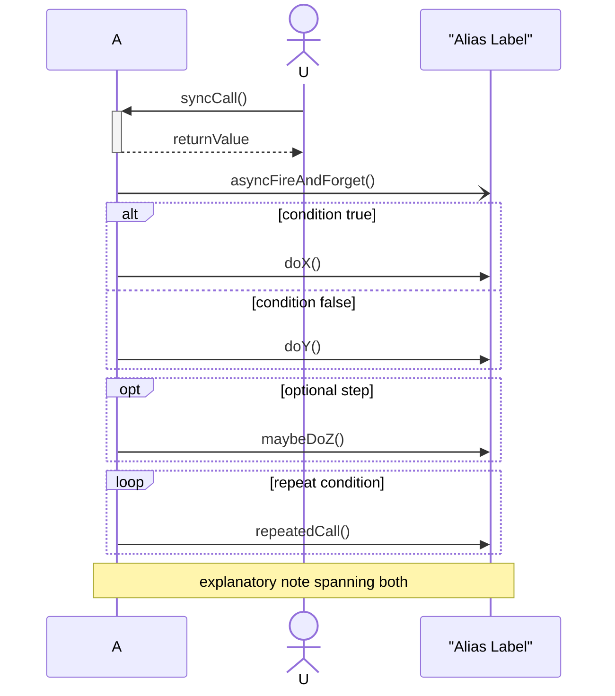

# COMP2511 — Exam Quick Reference Manual

> **How to use this document:** Ctrl+F for a concept name (e.g. "Strategy", "Long Method", "Mermaid", "Microservices") and read top-to-bottom: What it is → When to use/not use → Example → Exam recognition. This is a *reasoning layer*, not a slide dump — your actual lecture slides are the source of truth for anything UNSW-specific. Content here comes from general software-design knowledge unless marked **COMP2511 example**.

---

## Table of Contents

1. [OOP Fundamentals](#1-oop-fundamentals)
2. [Design Principles (SOLID + friends)](#2-design-principles)
3. [Code Smells → Refactoring](#3-code-smells)
4. [Design by Contract & Defensive Programming](#4-design-by-contract--defensive-programming)
5. [Design Patterns](#5-design-patterns)
6. [Functional Programming](#6-functional-programming)
7. [Event-Driven Programming & Observer](#7-event-driven-programming--observer)
8. [Asynchronous Design](#8-asynchronous-design)
9. [JUnit / Testing](#9-junit--testing)
10. [Domain Modelling](#10-domain-modelling)
11. [UML / C4 Interpretation](#11-uml--c4-interpretation)
12. [Mermaid Sequence Diagrams](#12-mermaid-sequence-diagrams--priority-section)
13. [Software Architecture](#13-software-architecture)
14. [Quality Attributes](#14-quality-attributes)
15. [Architecture Decision-Making](#15-architecture-decision-making)
16. [Design Rationale Phrasebook](#16-design-rationale-phrasebook)
17. [Practical Exam Workflow](#17-practical-exam-workflow)
18. [Master Decision Tables](#18-master-decision-tables)
19. [Common Exam Traps](#19-common-exam-traps)

---

# 1. OOP Fundamentals

## Encapsulation

**What is it?** Bundling data with the methods that operate on it, and hiding internal state behind a controlled interface (private fields, public methods).
**Why?** Protects invariants — the object controls how its state changes, not the caller.
**Java:**

```java
public class BankAccount {
    private double balance; // hidden
    public void deposit(double amt) {
        if (amt < 0) throw new IllegalArgumentException();
        balance += amt;
    }
    public double getBalance() { return balance; }
}
```

**When NOT relevant:** Pure data-transfer objects sometimes expose fields directly — but this is rare and should be justified.
**Common mistake:** Public fields, or getters/setters that expose mutable internal collections directly (`return this.items;` lets callers mutate your internal list — return a copy or unmodifiable view).
**Exam recognition:** "expose only what's necessary", "protect internal state" → encapsulation.

## Abstraction

**What is it?** Exposing *what* something does while hiding *how*. Achieved via interfaces/abstract classes.
**Why?** Lets callers depend on behaviour, not implementation — implementation can change freely.
**Java:** `interface PaymentMethod { void pay(double amount); }` — caller doesn't care if it's `CreditCard` or `PayPal`.
**Exam recognition:** "the client shouldn't need to know the implementation details" → abstraction.

## Inheritance

**What is it?** A class (subclass) acquires fields/methods from a parent (superclass) via `extends`.
**Why?** Code reuse + polymorphism when there's a genuine **is-a** relationship.
**When to use:** True taxonomic is-a relationship where the subtype is substitutable everywhere the supertype is used (see LSP).
**When NOT to use:** When you just want code reuse without a real is-a relationship ("a Car is-a Engine" is false — that's has-a → composition). Deep inheritance chains are fragile and hard to test.
**Common mistake:** Inheriting purely to reuse a method, producing nonsensical hierarchies (`Square extends Rectangle` breaks LSP because setting width/height independently is a Rectangle-only behaviour).
**Exam recognition:** "shares behaviour with", "is a specialised kind of" → check if it's genuinely substitutable before reaching for inheritance.

## Composition & Aggregation vs Inheritance

| | Composition | Aggregation | Inheritance |
| --- | --- | --- | --- |
| Relationship | strong has-a (owns) | weak has-a (uses/holds) | is-a |
| Lifecycle | part dies with whole | part outlives whole | N/A |
| UML | filled diamond | hollow diamond | solid line + hollow triangle |
| Coupling | lower than inheritance | lowest | tightest |
| Flexibility | can swap parts at runtime | can swap parts at runtime | fixed at compile time |

**Why composition is often preferred ("composition over inheritance"):**

- Avoids fragile base class problem (changing parent breaks all subclasses).
- Avoids LSP violations from forced substitutability.
- Behaviour can be swapped at *runtime* (a `Car` can swap its `Engine` object; it can't swap its superclass).
- Keeps hierarchies shallow — easier to reason about and test.

**Bad example (inheritance for code reuse only):**

```java
class Stack extends ArrayList<Integer> { } // Stack "is-a" ArrayList exposes add(index,...), remove(index,...) — breaks the Stack invariant
```

**Better example (composition):**

```java
class Stack {
    private final List<Integer> items = new ArrayList<>();
    void push(int x) { items.add(x); }
    int pop() { return items.remove(items.size() - 1); }
}
```

**Why better:** `Stack` only exposes push/pop — the internal `ArrayList` API is hidden, invariants protected.
**Exam recognition:** If a question describes a class "using" or "made up of" another class's behaviour but isn't truly a subtype → composition/aggregation, not inheritance.

## Interface vs Abstract Class

| | Interface | Abstract Class |
| --- | --- | --- |
| Purpose | defines a **contract** (capability) | defines a **partial implementation** + shared state |
| Fields | only `static final` constants | can have instance fields |
| Constructors | none | yes |
| Multiple inheritance | a class can implement many | a class can extend only one |
| Method bodies | default/static methods allowed (Java 8+) but no instance state | full method bodies allowed |
| Relationship implied | "can do" (capability) | "is a" (taxonomy) with shared code |

**When to use interface:** You want to define a capability multiple unrelated classes can offer (`Comparable`, `Flyable`) — especially across otherwise unrelated class hierarchies.
**When to use abstract class:** Related classes share common state/behaviour but some methods must be specialised (template method pattern).
**When NOT to use either:** Don't create an interface with only one implementer "just in case" — that's speculative generality (see smells).
**Exam recognition:** "multiple unrelated classes need to support this behaviour" → interface. "These classes share common code but differ in one step" → abstract class.

## Method Overriding vs Overloading

- **Overriding:** subclass redefines a superclass method with the *same signature* — runtime polymorphism (`@Override`).
- **Overloading:** multiple methods in the *same class* with the same name but different parameter lists — compile-time resolution.
**Common mistake:** Confusing overloading with polymorphism — overloading is resolved statically, not dynamically.

## Coupling & Cohesion

- **Coupling** = how much one class depends on the internals of another. **Low coupling is good** — classes can change independently.
- **Cohesion** = how focused a class's responsibilities are. **High cohesion is good** — a class does one thing well.
**Exam recognition:** "changing class A always forces changes to class B" → high coupling (bad). "This class does five unrelated things" → low cohesion (bad).

---

# 2. Design Principles

## SOLID — Quick Table

| Principle | What to look for | Typical violation | Typical fix |
| --- | --- | --- | --- |
| **S**RP | class has one reason to change | God class doing I/O + logic + validation | Split into focused classes |
| **O**CP | open for extension, closed for modification | new `if/switch` branch added every time a new type appears | Extract interface + polymorphism/Strategy |
| **L**SP | subtypes substitutable for base type | subclass throws `UnsupportedOperationException` or narrows behaviour | Favour composition, or redesign hierarchy |
| **I**SP | clients shouldn't depend on methods they don't use | "fat" interface forcing no-op implementations | Split into smaller, role-specific interfaces |
| **D**IP | depend on abstractions, not concretions | high-level class `new`s a concrete low-level class directly | Inject an interface (constructor injection) |

### Single Responsibility Principle (SRP)

**Definition:** A class should have only one reason to change.
**Problem it solves:** God classes that mix unrelated concerns become impossible to change safely — a change to persistence logic risks breaking validation logic.
**Recognise a violation:** Class name is vague (`Manager`, `Handler`, `Util`), or you can't summarise its job in one sentence without "and".
**Bad:**

```java
class Order {
    void calculateTotal() { ... }
    void saveToDatabase() { ... }   // persistence concern
    void printReceipt() { ... }     // presentation concern
}
```

**Fixed:**

```java
class Order { void calculateTotal() { ... } }
class OrderRepository { void save(Order o) { ... } }
class ReceiptPrinter { void print(Order o) { ... } }
```

**Why the fix works:** Each class now changes for exactly one reason (business rule change vs DB schema change vs receipt format change).
**When NOT to over-apply:** Splitting a tiny, cohesive class into three trivial classes for the sake of "one reason to change" adds needless indirection — SRP is about *reasons to change*, not method count.
**Exam trigger:** "This class handles calculation, storage, and formatting" → SRP violation.

### Open/Closed Principle (OCP)

**Definition:** Software entities should be open for extension but closed for modification.
**Problem it solves:** Every new requirement forcing edits to existing, tested code risks regressions.
**Recognise a violation:** A `switch`/`if-else` chain on a type tag that needs a new branch every time a new variant is added.
**Bad:**

```java
double area(Shape s) {
    if (s.type == CIRCLE) return Math.PI * s.radius * s.radius;
    else if (s.type == SQUARE) return s.side * s.side;
    // adding Triangle means editing this method again
}
```

**Fixed:**

```java
interface Shape { double area(); }
class Circle implements Shape { public double area() { return Math.PI * r * r; } }
class Square implements Shape { public double area() { return side * side; } }
// new shapes: add a new class, never touch existing code
```

**When NOT to over-apply:** Introducing an interface + polymorphism for something that will never vary is speculative generality — YAGNI applies.
**Exam trigger:** "New requirement types keep getting added" / "avoid modifying tested code" → OCP + Strategy/Factory.

### Liskov Substitution Principle (LSP)

**Definition:** Subtypes must be substitutable for their base type without altering correctness — a caller using the base type shouldn't be able to tell (or break) when given a subtype.
**Recognise a violation:** Subclass overrides a method to throw an exception, do nothing, or narrow preconditions/widen postconditions in a way that surprises callers.
**Bad (classic example):**

```java
class Rectangle { void setWidth(int w) {...} void setHeight(int h) {...} }
class Square extends Rectangle {
    void setWidth(int w) { super.setWidth(w); super.setHeight(w); } // breaks caller expectations
}
```

A method that does `rect.setWidth(5); rect.setHeight(4); assert area == 20;` silently fails for `Square`.
**Fixed:** Don't model `Square` as a `Rectangle` subclass — use a common `Shape` interface instead, or don't inherit at all.
**Why the fix works:** No implicit contract is broken; each shape independently satisfies its own contract.
**Common mistake:** Assuming any "is-a" in English implies safe inheritance in code — LSP is about *behavioural* substitutability, not naming.
**Exam trigger:** "a subclass throws an exception for a method the parent supports" / "overriding narrows what's accepted or widens what's promised" → LSP violation.

### Interface Segregation Principle (ISP)

**Definition:** Clients should not be forced to depend on methods they do not use.
**Problem it solves:** Fat interfaces force implementers to write no-op/exception-throwing stub methods.
**Bad:**

```java
interface Worker { void work(); void eat(); }
class RobotWorker implements Worker {
    public void work() { ... }
    public void eat() { throw new UnsupportedOperationException(); } // forced to implement irrelevant method
}
```

**Fixed:**

```java
interface Workable { void work(); }
interface Eatable { void eat(); }
class RobotWorker implements Workable { public void work() { ... } }
class HumanWorker implements Workable, Eatable { ... }
```

**When NOT to over-apply:** Splitting every interface into single-method interfaces regardless of cohesion creates interface sprawl — group methods that genuinely belong together as one role.
**Exam trigger:** "this class is forced to implement a method it doesn't need / throws UnsupportedOperationException" → ISP violation → split the interface.

### Dependency Inversion Principle (DIP)

**Definition:** High-level modules should not depend on low-level modules; both should depend on abstractions. Abstractions should not depend on details; details depend on abstractions.
**Problem it solves:** High-level business logic tightly coupled to a specific low-level implementation (e.g. a specific database) can't be tested or swapped.
**Bad:**

```java
class OrderService {
    private MySqlDatabase db = new MySqlDatabase(); // depends on concrete class
}
```

**Fixed:**

```java
interface Database { void save(Order o); }
class OrderService {
    private final Database db;
    OrderService(Database db) { this.db = db; } // depends on abstraction, injected
}
```

**Why the fix works:** `OrderService` can be tested with a mock `Database`, and the real implementation can change without touching `OrderService`.
**Related:** This is what enables **dependency injection** and easy unit testing/mocking.
**Exam trigger:** "hard to test because it directly creates its dependencies" / "swap the implementation without changing this class" → DIP.

## Other Principles

### DRY (Don't Repeat Yourself)

Every piece of knowledge should have a single, unambiguous representation. Violation → duplicate code smell. Over-application → premature abstraction merging things that only *coincidentally* look similar (see also: not everything similar-looking is actually the same concept).

### KISS (Keep It Simple, Stupid)

Prefer the simplest design that satisfies requirements. Violation → overengineering, unnecessary patterns/abstractions.

### YAGNI (You Aren't Gonna Need It)

Don't build for hypothetical future requirements. Directly opposes "add an interface just in case" reasoning — a major exam trap.

### Separation of Concerns

Different concerns (business logic, persistence, presentation) should live in different modules — closely related to SRP and to layered architecture (Section 13).

### Law of Demeter ("don't talk to strangers")

An object should only call methods on: itself, its own fields, objects passed as parameters, objects it creates. Avoid chains like `a.getB().getC().doSomething()` — this creates hidden coupling to the internal structure of `B`.
**Fix:** expose a method on `A` that delegates internally (`a.doSomethingOnC()`), so `A`'s internal structure can change without breaking callers.

---

# 3. Code Smells

> A code smell is a *symptom* of a deeper design problem, not the problem itself — always diagnose the underlying principle violation before refactoring.

## Long Method

**What it looks like:** A method doing many distinct steps, often 30+ lines, mixing levels of abstraction.
**Why bad:** Hard to read, test, and reuse pieces of; usually violates SRP at the method level.
**Diagnosis:** The method is doing more than "one thing."
**Refactoring:** **Extract Method** — pull cohesive chunks into well-named private methods.
**Bad:**

```java
void processOrder(Order o) {
    // validate (10 lines)
    // calculate total (8 lines)
    // apply discount (6 lines)
    // save to db (5 lines)
    // send email (4 lines)
}
```

**Improved:**

```java
void processOrder(Order o) {
    validate(o);
    double total = calculateTotal(o);
    total = applyDiscount(total, o);
    save(o);
    notifyCustomer(o);
}
```

**Related principle:** SRP. **Related pattern:** none directly, but often the first step before applying Strategy.
**Exam recognition:** A method whose name doesn't describe everything it does.

## Large Class / God Class

**What it looks like:** A class with many fields/methods handling multiple unrelated responsibilities.
**Why bad:** Violates SRP; hard to understand, test, and change safely.
**Refactoring:** **Extract Class** — split into multiple classes along responsibility lines.
**Related principle:** SRP.

## Feature Envy

**What it looks like:** A method that uses another class's data/methods more than its own.
**Why bad:** Signals the method (and its logic) belongs on the other class — indicates misplaced responsibility.
**Bad:**

```java
class Invoice {
    double total(Customer c) {
        return c.getItems().stream().mapToDouble(Item::getPrice).sum() * (1 - c.getDiscountRate());
    }
}
```

**Refactoring:** **Move Method** — move `total()` logic onto `Customer` (or the data it envies).
**Related principle:** high cohesion / Law of Demeter.

## Long Parameter List

**What it looks like:** Methods/constructors with 4+ parameters, especially several of the same primitive type.
**Why bad:** Easy to pass arguments in the wrong order; hard to read call sites.
**Refactoring:** **Introduce Parameter Object** — group related parameters into a class.
**Related smell:** Primitive Obsession.

## Duplicate Code

**What it looks like:** Identical or near-identical code blocks in multiple places.
**Why bad:** Violates DRY — a bug fix or change must be applied in every copy.
**Refactoring:** **Extract Method/Class**, or **Pull Up Method** into a shared superclass, or Strategy/Template Method if the duplication is "same skeleton, different step."

## Switch/Conditional Complexity (Type-checking conditionals)

**What it looks like:** `switch`/`if-else` chains branching on a type code, repeated in multiple places.
**Why bad:** Violates OCP — adding a new type means hunting down every switch statement.
**Refactoring:** **Replace Conditional with Polymorphism** — introduce a common interface/abstract class and let each subtype implement its own behaviour (this is essentially the **Strategy** pattern in disguise).
**Related principle/pattern:** OCP, Strategy.

## Shotgun Surgery

**What it looks like:** One conceptual change requires many small edits scattered across many classes.
**Why bad:** High coupling; changes are risky and easy to miss a spot.
**Refactoring:** **Move Method/Field** to consolidate related behaviour into fewer classes.
**Contrast with Divergent Change:** Shotgun Surgery = one change, many classes touched. Divergent Change = one class touched for many *different* reasons.

## Divergent Change

**What it looks like:** A single class is modified for many unrelated reasons (e.g. `Order` changes for both billing rules and formatting rules).
**Why bad:** Violates SRP.
**Refactoring:** **Extract Class**, splitting responsibilities apart.

## Primitive Obsession

**What it looks like:** Using primitives (`String`, `int`, `double`) to represent domain concepts (money, email, phone number) instead of small dedicated types.
**Why bad:** No validation/behaviour attached; easy to pass wrong values (e.g. swapping two `String` parameters).
**Refactoring:** **Replace Primitive with Object** — introduce a small class/value type (e.g. `Money`, `EmailAddress`).
**Related smell:** Long Parameter List, Data Clumps.

## Data Clumps

**What it looks like:** The same group of fields/parameters (e.g. `street, city, postcode`) appears together repeatedly.
**Why bad:** Signals a missing abstraction (`Address`).
**Refactoring:** **Extract Class** to group them.

## Inappropriate Intimacy

**What it looks like:** Two classes access each other's private fields/internals excessively.
**Why bad:** Extremely high coupling — changes to one ripple into the other.
**Refactoring:** **Move Method/Field**, or hide internals better (encapsulation), or merge classes if they truly are one concept.

## Speculative Generality

**What it looks like:** Abstract classes, interfaces, or hooks added "just in case" with no current use.
**Why bad:** Adds complexity with no present benefit — violates YAGNI.
**Refactoring:** **Collapse Hierarchy** / remove unused abstraction until it's actually needed.
**Exam trigger:** "an interface with only one implementation and no planned second one."

## Refused Bequest

**What it looks like:** A subclass uses only a small part of its parent's interface, or overrides methods to do nothing/throw exceptions.
**Why bad:** Signals the inheritance relationship is wrong (often an LSP violation).
**Refactoring:** Replace inheritance with composition, or restructure the hierarchy.

## Message Chains

**What it looks like:** `a.getB().getC().getD().doSomething()`.
**Why bad:** Violates Law of Demeter; caller becomes coupled to the internal structure of unrelated classes.
**Refactoring:** **Hide Delegate** — add a method to `A` that does the delegation internally.

## Middle Man

**What it looks like:** A class whose methods mostly just delegate to another class, adding little of its own.
**Why bad:** Unnecessary indirection.
**Refactoring:** Remove the middle man and call the real object directly — **but** note this is the opposite fix to Message Chains; the right amount of delegation is a judgement call based on whether the indirection is hiding useful complexity or just adding a pointless layer.

## Dead Code

**What it looks like:** Unused methods, fields, classes.
**Why bad:** Clutters the codebase, misleads readers about what's actually used.
**Refactoring:** Delete it (version control remembers it if it's ever needed again).

### Code Smell Summary Table

| Smell | Symptoms | Why bad | Typical Refactoring | Principle/Pattern |
| --- | --- | --- | --- | --- |
| Long Method | many steps in one method | hard to read/test | Extract Method | SRP |
| Large/God Class | many unrelated responsibilities | hard to change safely | Extract Class | SRP |
| Feature Envy | method uses another class's data more than own | misplaced responsibility | Move Method | Cohesion |
| Long Parameter List | 4+ params | error-prone calls | Introduce Parameter Object | — |
| Duplicate Code | copy-pasted logic | DRY violation | Extract Method/Strategy | DRY |
| Switch on type | repeated type-check branches | OCP violation | Replace Conditional w/ Polymorphism | OCP, Strategy |
| Shotgun Surgery | one change, many files touched | high coupling | Move Method/Field | Coupling |
| Divergent Change | one class, many reasons to change | SRP violation | Extract Class | SRP |
| Primitive Obsession | primitives standing in for domain concepts | no validation/behaviour | Replace Primitive w/ Object | — |
| Data Clumps | same field group repeated | missing abstraction | Extract Class | — |
| Inappropriate Intimacy | classes reach into each other's internals | high coupling | Move Method, better encapsulation | Coupling |
| Speculative Generality | unused abstraction "just in case" | needless complexity | Collapse Hierarchy | YAGNI |
| Refused Bequest | subclass ignores/rejects parent behaviour | broken is-a | Replace inheritance w/ composition | LSP |
| Message Chains | `a.getB().getC()...` | Law of Demeter violation | Hide Delegate | Law of Demeter |
| Middle Man | class only delegates | pointless indirection | Remove Middle Man | — |
| Dead Code | unused code | clutter | Delete | — |

---

# 4. Design by Contract & Defensive Programming

## Design by Contract

**What is it?** Formalising the obligations between a method and its caller:

- **Precondition** — what the caller must guarantee true before calling.
- **Postcondition** — what the method guarantees true after it returns (if precondition held).
- **Invariant** — what must always hold true for an object between calls.
**Why?** Makes responsibilities explicit: if the caller violates a precondition, the method is *not* obligated to behave sensibly (that's the caller's bug, not the method's).
**Example:**

```java
/**
 * Precondition: amount > 0
 * Postcondition: balance increases by amount
 */
void deposit(double amount) {
    assert amount > 0; // caller's responsibility to satisfy this
    balance += amount;
}
```

**Relation to LSP:** subclasses must not strengthen preconditions or weaken postconditions of the method they override — this is precisely what LSP requires.

## Defensive Programming

**What is it?** The method itself validates inputs and handles bad/unexpected data gracefully, regardless of what the "contract" says the caller should provide.
**When appropriate:** Public-facing APIs, boundaries with untrusted input (user input, network, files) — where you can't trust the caller obeyed the contract.
**Example:**

```java
void deposit(double amount) {
    if (amount <= 0) throw new IllegalArgumentException("amount must be positive");
    balance += amount;
}
```

**Contrast with Design by Contract:** DbC says "garbage in → undefined behaviour is caller's fault"; defensive programming says "check everything, fail predictably even on caller error." Internal/trusted code often prefers DbC (cheaper, clearer contracts); external boundaries usually need defensive checks.
**Common mistake:** Defensively checking *everywhere*, including between tightly-coupled internal methods you fully control — this bloats code without adding safety, since the contract is already enforced by construction.

---

# 5. Design Patterns

> **Don't memorise these as templates — learn the trigger.** For each pattern: "I see this requirement/problem → therefore this pattern may fit because Y. If I instead see Z, it's probably unnecessary."

## Strategy Pattern

**Intent:** Define a family of interchangeable algorithms/behaviours, encapsulate each one, and make them swappable at runtime.
**Problem:** A class needs to vary *how* it does something (e.g. sort order, pricing rule, movement behaviour) without a giant conditional, and without hardcoding one algorithm.
**Structure:** `Context` holds a reference to a `Strategy` interface; concrete strategies implement it; `Context` delegates the varying behaviour to whichever strategy it holds.
**Java:**

```java
interface DiscountStrategy { double apply(double price); }
class NoDiscount implements DiscountStrategy { public double apply(double p) { return p; } }
class PercentOff implements DiscountStrategy {
    private double pct;
    PercentOff(double pct) { this.pct = pct; }
    public double apply(double p) { return p * (1 - pct); }
}
class Order {
    private DiscountStrategy discount;
    Order(DiscountStrategy d) { this.discount = d; }
    double total(double price) { return discount.apply(price); }
}
```

**When to use:** Multiple interchangeable algorithms; you want to add new ones without touching existing code (OCP); behaviour must be selectable/swappable at runtime.
**When NOT to use:** Only one algorithm exists and none is planned — that's speculative generality; a simple `if/else` with two permanent branches may be clearer.
**Advantages:** OCP-friendly, removes conditional logic, testable in isolation.
**Disadvantages:** More classes/files; caller must know which strategy to construct.
**Common mistake:** Creating a Strategy interface for a single implementation "just in case."
**Related principle:** OCP, SRP. **Related pattern:** often replaces a Switch/Conditional-Complexity smell.
**Exam recognition:** "the algorithm/rule/behaviour needs to vary and be selected at runtime" / "avoid a big if-else for different behaviours" → Strategy.

## Observer Pattern

**Intent:** Define a one-to-many dependency so that when one object (Subject) changes state, all its dependents (Observers) are notified automatically.
**Problem:** Multiple parts of a system need to react to a state change without the subject knowing concrete details about them (decoupling producers of change from consumers).
**Structure:** `Subject` maintains a list of `Observer`s, exposes `subscribe`/`unsubscribe`, and calls `notify()` on all observers when its state changes.
**Java:**

```java
interface Observer { void update(String event); }
class Subject {
    private List<Observer> observers = new ArrayList<>();
    void subscribe(Observer o) { observers.add(o); }
    void notifyAll(String event) { for (Observer o : observers) o.update(event); }
}
```

**Push vs pull:** *Push* — subject sends the full event data to observers. *Pull* — subject just says "something changed," observers query the subject for what they need. Push is simpler; pull scales better when different observers need different data.
**When to use:** Event-driven UIs, pub/sub systems, decoupling a game entity from things that react to its state (e.g. UI health bar reacting to `Player` HP changes).
**When NOT to use:** Only one fixed observer that will never change — a direct method call is simpler.
**Advantages:** Loose coupling (Subject doesn't know concrete Observer types); supports dynamic subscription.
**Disadvantages:** Can create surprising cascades of updates; memory leaks if observers aren't unsubscribed; ordering of notifications isn't always guaranteed/meaningful.
**Common mistake:** Forgetting to unsubscribe (dangling references / memory leak); observer logic doing too much inside `update()`.
**Related to:** event-driven programming (Section 7) — Observer is the classic OOP mechanism *behind* many event systems.
**Exam recognition:** "multiple components need to react when X changes, without X needing to know about them" → Observer.

## Composite Pattern

**Intent:** Compose objects into tree structures to represent part-whole hierarchies, letting clients treat individual objects and compositions uniformly.
**Problem:** You have a hierarchy of "leaf" and "container" objects (files/folders, UI widgets, game entities) and want to call the same operation on either without type-checking.
**Structure:** A common `Component` interface implemented by both `Leaf` and `Composite` (which holds a list of child `Component`s and delegates operations to them).
**Java:**

```java
interface FileSystemItem { int size(); }
class File implements FileSystemItem {
    private int sizeBytes;
    public int size() { return sizeBytes; }
}
class Folder implements FileSystemItem {
    private List<FileSystemItem> children = new ArrayList<>();
    public int size() { return children.stream().mapToInt(FileSystemItem::size).sum(); }
}
```

**When to use:** Recursive tree structures where you want uniform treatment of leaves and containers (menus, org charts, game object groups).
**When NOT to use:** No genuine part-whole hierarchy — forcing Composite onto a flat structure adds needless indirection.
**Advantages:** Client code doesn't need `instanceof` checks; simplifies recursive operations.
**Disadvantages:** Can make it harder to restrict what types of children a container may hold (type safety trade-off).
**Common mistake:** Giving `Leaf` meaningless implementations of container-only methods (e.g. `addChild()` on a `File`) — this itself can become an ISP/LSP smell; a cleaner design keeps child-management methods only on `Composite`.
**Related pattern:** often paired with Visitor (not always taught) for operations across the tree.
**Exam recognition:** "tree structure," "part-whole," "treat a single item and a group of items the same way" → Composite.

## Factory Method / Simple Factory / Abstract Factory

**Simple Factory (not a GoF pattern, but common):** A single method/class that creates objects based on input, hiding `new` calls from the client.

```java
class ShapeFactory {
    static Shape create(String type) {
        return switch (type) {
            case "circle" -> new Circle();
            case "square" -> new Square();
            default -> throw new IllegalArgumentException();
        };
    }
}
```

*Note: this still has an `if/switch`, so it doesn't fully satisfy OCP by itself — it just centralises the object-creation conditional in one place instead of scattering it.*

**Factory Method (GoF):** Define an interface for creating an object, but let subclasses decide which class to instantiate.

```java
abstract class Dialog {
    abstract Button createButton(); // subclasses decide the concrete type
    void render() { Button b = createButton(); b.draw(); }
}
class WindowsDialog extends Dialog { Button createButton() { return new WindowsButton(); } }
```

**Abstract Factory (GoF):** A factory of factories — produces *families* of related objects without specifying concrete classes.

```java
interface UIFactory { Button createButton(); Checkbox createCheckbox(); }
class WindowsUIFactory implements UIFactory { ... }
class MacUIFactory implements UIFactory { ... }
```

**Why factories exist:** Decouple object *construction* from object *use* — the caller doesn't need to know which concrete class to instantiate, satisfying DIP/OCP.
**When they help:** Object creation logic is complex, varies by context, or needs to stay swappable/extensible.
**When they add unnecessary abstraction:** Trivial object creation (`new Point(x, y)`) never needs a factory.
**Exam recognition:** "the system needs to create different concrete types without the client knowing which one" → Factory family.

## Singleton

**Intent:** Ensure a class has only one instance, with a global point of access to it.
**Java:**

```java
class ConfigManager {
    private static ConfigManager instance;
    private ConfigManager() { }
    public static ConfigManager getInstance() {
        if (instance == null) instance = new ConfigManager();
        return instance;
    }
}
```

**Why people use it:** Shared config/logging/resource that genuinely should exist once.
**Problems with Singleton:**

- Introduces **global mutable state**, which makes reasoning about the program harder.
- **Hurts testability** — hard to substitute a mock, tests can leak state between each other via the shared instance.
- **Hides dependencies** — a class using `ConfigManager.getInstance()` doesn't declare that dependency in its constructor, unlike DIP-friendly injection.
- Can hide concurrency bugs (shared mutable state accessed from multiple places).
**When it may be appropriate:** Truly single, stateless or read-only global resources (e.g. a logging facade), used sparingly.
**When to avoid:** Anything with mutable state that tests need to isolate, or that might genuinely need multiple instances later (many "must be one instance" assumptions turn out to be wrong).
**Exam recognition:** Do **not** treat Singleton as automatically "the right pattern" just because something *could* be global — this is a classic exam trap (Section 19). Prefer dependency injection where possible.

## Pattern Comparison Table

| Pattern | Problem solved | Key mechanism | Watch out for |
| --- | --- | --- | --- |
| Strategy | swap an algorithm/behaviour | delegate to an interface, injected | don't create for a single fixed behaviour |
| Observer | notify many dependents of a change | subject holds list of observers, calls back | memory leaks from missed unsubscribe |
| Composite | uniform treatment of tree part/whole | shared interface for leaf & container | forcing container-only ops onto leaves |
| Factory Method/Abstract Factory | decouple creation from use | subclasses/factories choose concrete type | overkill for trivial construction |
| Singleton | exactly one global instance | private constructor + static accessor | global mutable state, poor testability |

---

# 6. Functional Programming

## Core Concepts

- **Pure function:** output depends only on inputs, no side effects (no mutation, no I/O). Same input → always same output.
- **Immutability:** once created, an object's state never changes — instead of mutating, produce a new object.
- **Side effects:** anything observable outside the function's return value (mutating shared state, printing, writing files).
- **Higher-order function:** a function that takes and/or returns other functions.
- **Lambda:** an anonymous, inline function.
- **Functional interface:** an interface with exactly one abstract method — Java lambdas implement these (`Runnable`, `Comparator`, `Function<T,R>`).

**Java:**

```java
List<Integer> nums = List.of(1, 2, 3, 4);
List<Integer> doubled = nums.stream()
    .map(n -> n * 2)          // higher-order fn, lambda
    .filter(n -> n > 2)
    .collect(Collectors.toList());
```

**Why useful:** Pure/immutable code is easier to reason about, test, and parallelise — no hidden state to track.
**When to use:** Data transformation pipelines, avoiding shared mutable state, expressing "what" rather than "how" (declarative).
**When NOT to use:** Performance-critical tight loops where the overhead of streams/boxing matters; or when imperative code is genuinely clearer for simple sequential logic.
**Common mistake:** Using a stream `.forEach()` with a side effect (mutating an external variable) — this defeats the purpose of functional style and can introduce subtle bugs.
**Design implications:** Pure functions are trivially unit-testable (no setup/mocking needed) and thread-safe by default.

---

# 7. Event-Driven Programming & Observer

**What is it?** A paradigm where program flow is driven by events (user actions, messages, sensor triggers) rather than a predetermined sequential script.
**Key roles:**

- **Event producer** — emits an event when something happens.
- **Event consumer/handler** — subscribes and reacts.
- **Event loop** — continuously waits for and dispatches events (common in GUIs, servers).
**Flow:** `Event occurs → producer emits → subscribers receive → handlers execute` (asynchronously, potentially many-to-one or one-to-many).
**Benefits:** Decoupling (producer doesn't know/care who's listening); naturally models real-world reactive systems (UI clicks, sensors, messages).
**Trade-offs:** Harder to trace control flow ("what triggers what" isn't linear); ordering/timing bugs; debugging is harder than step-through sequential code.
**Relation to Observer pattern:** Observer is the classic *object-oriented implementation* of the event-driven idea within a single process — Subject = producer, Observer = consumer. Distributed event-driven *architecture* (Section 13) applies the same idea across services, typically via a message broker.

---

# 8. Asynchronous Design

| | Synchronous | Asynchronous |
| --- | --- | --- |
| Caller behaviour | blocks/waits for result | continues immediately, gets result later (callback/future/event) |
| Simplicity | easier to read and reason about | harder — non-linear control flow |
| Throughput | caller idle while waiting | caller can do other work while waiting |
| Failure handling | exceptions propagate naturally | must be handled in the async callback/promise |
| Ordering | guaranteed (sequential) | not guaranteed unless explicitly managed |

**Key concepts:**

- **Blocking vs non-blocking:** blocking = thread halts until the operation completes; non-blocking = thread returns immediately, notified later.
- **Callback:** a function passed in to be invoked when the async operation finishes.
- **Race condition:** two operations access shared state concurrently and the outcome depends on unpredictable timing.
**Benefits:** Better resource utilisation (don't block a thread waiting on I/O), responsiveness (e.g. UI stays responsive during a network call).
**Complexity costs:** Error handling is harder (which callback catches the failure?), reasoning about ordering is harder, debugging stack traces are less linear.
**Exam recognition:** "the system should not block/wait while X happens" / "handle a response later via a callback/event" → asynchronous design; if a scenario mentions timing-dependent bugs from concurrent access → race condition.

---

# 9. JUnit / Testing

## Structure

```java
class CalculatorTest {
    private Calculator calc;

    @BeforeEach
    void setUp() { calc = new Calculator(); } // runs before each test — fresh fixture

    @Test
    void addsTwoPositiveNumbers() {
        assertEquals(5, calc.add(2, 3));
    }

    @Test
    void divideByZeroThrows() {
        assertThrows(ArithmeticException.class, () -> calc.divide(1, 0));
    }
}
```

## Common Assertions

| Assertion | Tests that... |
| --- | --- |
| `assertEquals(expected, actual)` | two values are equal |
| `assertTrue(cond)` / `assertFalse(cond)` | a boolean condition |
| `assertThrows(Exc.class, () -> ...)` | an exception of a given type is thrown |
| `assertNull` / `assertNotNull` | a reference is/isn't null |
| `assertSame` / `assertNotSame` | reference equality (same object) |

**`@Test`** marks a method as a test case. **`@BeforeEach`/`@AfterEach`** run setup/teardown around every test (test fixture) — keeps tests independent of each other's state.
**What to test:** normal/expected input (happy path), boundary/edge cases (0, empty list, max value), and failure cases (invalid input → correct exception).
**Testability and design:** Good design *improves* testability —

- DIP (injected dependencies) lets you substitute mocks/stubs instead of real DB/network calls.
- SRP means a test for one class doesn't require setting up unrelated behaviour.
- Pure functions (Section 6) need no mocking at all — just call with inputs and assert on outputs.
- Singleton / global mutable state (Section 5) *hurts* testability — state can leak between tests.
**Common mistake:** One test asserting multiple unrelated things (unclear what failed and why); tests that depend on execution order or shared mutable fixtures.

---

# 10. Domain Modelling

## Workflow: from scenario to class design

1. **Extract domain concepts** — nouns in the scenario are candidate classes/attributes; verbs are candidate methods.
2. **Identify candidate classes** — group related nouns; discard purely incidental ones.
3. **Identify responsibilities** — what does each class need to *know* and *do*? (assign responsibility to whichever class naturally owns the data — related to Feature Envy avoidance).
4. **Identify relationships** — association, aggregation, composition, inheritance between the classes.
5. **Decide inheritance vs composition** — is it truly is-a (substitutable) or has-a?
6. **Identify interfaces** — any capability shared across otherwise-unrelated classes?
7. **Determine fields** — what state does each class need to fulfil its responsibilities?
8. **Determine methods** — what behaviour is needed, with what signatures?
9. **Determine cardinalities** — one-to-one, one-to-many, many-to-many between related classes.
10. **Review coupling/cohesion** — does every class have a single, focused purpose? Is coupling minimised?
11. **Check extensibility** — could a plausible future requirement be added without major rewrites (OCP)?
12. **Justify design decisions** — be ready to explain *why* each structural choice was made (Section 16).

## Relationship types recap

- **Association** — general "uses/knows about" relationship, no ownership implied (`Driver` knows about a `Car`).
- **Aggregation** — has-a, but the part can exist independently and outlive the whole (`Team` has `Players`, players can exist without the team).
- **Composition** — has-a, and the part's lifecycle is bound to the whole (`House` has `Rooms`; rooms don't exist without the house).
- **Cardinality** — how many of one entity relate to how many of another (`1`, `0..1`, `1..*`, `*`).

## Worked mini-example

**Scenario:** "A library lends books to members. Each book may have multiple copies. A member can borrow up to 3 books at a time."

**Reasoning:**

- Nouns → `Library`, `Book`, `Copy`, `Member`, `Loan`.
- `Library` *aggregates* `Member`s and `Book`s (they can exist conceptually without the specific library instance in a wider system, but here the library owns the catalog — composition is defensible too, state your assumption).
- A `Book` *composes* multiple `Copy` objects (copies don't exist without the book title existing).
- `Loan` is an **association class** connecting a `Member` to a `Copy` for a period — this is where "borrow" behaviour and its constraint (max 3 books) naturally lives.
- Cardinality: `Member` 1 — `0..3` active `Loan`s; `Book` 1 — `1..*` `Copy`.

**Java class signatures (exam-realistic level of detail):**

```java
class Book {
    private String title;
    private List<Copy> copies;
}
class Copy {
    private Book book;
    private boolean onLoan;
}
class Member {
    private String name;
    private List<Loan> activeLoans; // enforce max 3 here
    boolean canBorrow() { return activeLoans.size() < 3; }
}
class Loan {
    private Member member;
    private Copy copy;
    private LocalDate dueDate;
}
```

**Design note:** Putting the "max 3 books" rule inside `Member.canBorrow()` keeps that responsibility with the object that owns the relevant data (avoids Feature Envy) and keeps `Loan` itself simple.

> The exam is more likely to ask for class/interface/method signatures and design reasoning than a full UML diagram — practise going straight from a paragraph scenario to Java class skeletons.

---

# 11. UML / C4 Interpretation

> Focus: **reading** diagrams, not drawing them from scratch.

## UML Class Diagram symbols

| Symbol | Meaning |
| --- | --- |
| Solid line, hollow triangle arrowhead | Inheritance (`extends`) — arrow points to superclass |
| Dashed line, hollow triangle arrowhead | Interface implementation (`implements`) |
| Solid line, filled diamond | Composition — diamond is on the "whole" side |
| Solid line, hollow diamond | Aggregation — diamond is on the "whole" side |
| Solid line, plain arrow | Association / dependency |
| Dashed line, plain arrow | Dependency (weaker, e.g. method parameter use) |
| `+` / `-` / `#` | public / private / protected |
| `1`, `0..1`, `*`, `1..*` at line ends | Cardinality |
| *Italic* class/method name | Abstract |

**What you can infer:** direction of the diamond tells you which class "owns" the relationship; multiplicities tell you cardinality; italics tell you a class/method is abstract and must be overridden by a concrete subtype.

## C4 Model levels

| Level | Shows | Audience |
| --- | --- | --- |
| **Context** | The system as one box, plus external users/systems it interacts with | Non-technical stakeholders |
| **Container** | Deployable/runnable units inside the system (web app, API, database, mobile app) and how they communicate | Technical stakeholders / architects |
| **Component** | Major structural building blocks inside one container (e.g. services/controllers inside an API) | Developers/architects |
| **Code** | Class-level detail (rarely used in practice; UML class diagrams cover this) | Developers |

**What to infer:** Container diagrams tell you deployment boundaries and technology choices (arrows = protocols like HTTPS/JDBC); Component diagrams tell you internal structure of one container without needing to know full class detail.

---

# 12. Mermaid Sequence Diagrams — Priority Section

## What is a sequence diagram?

It shows the **order of messages exchanged between participants** over time — read top-to-bottom as a timeline, left-to-right as "who."

## Scenario → Diagram: repeatable method

1. **Identify actors** — external users/systems initiating interaction (draw as `actor`).
2. **Identify participants** — internal system components involved (draw as `participant`).
3. **Identify the starting event** — what kicks off the interaction?
4. **Identify messages** — what does each component ask/tell another to do?
5. **Determine message order** — the actual sequence of calls.
6. **Identify conditions** — does behaviour branch (`alt`/`opt`)?
7. **Identify loops** — does something repeat (`loop`)?
8. **Identify returns** — what does each call send back (dashed arrows)?
9. **Translate into Mermaid** syntax.

## Core syntax reference

**Declare participants (control display order):**



Use `actor Name` instead of `participant Name` for an external user (stick-figure symbol). Use `participant A as Alice` for a short alias with a longer display label.

**Arrow types:**

| Syntax | Meaning |
| --- | --- |
| `->>` | solid line, arrowhead — a synchronous call/request |
| `-->>` | dashed line, arrowhead — a return/response |
| `-)` | solid line, open arrow — async/"fire and forget" message |
| `--)` | dashed, open arrow — async response |
| `-x` | solid line, cross — a message that fails/is never received |

**Activation (shows a participant is "busy" processing):**



`+` after the arrow activates the target; `-` on the return deactivates it. Activations can stack if the same participant is called again before returning (e.g. recursive/nested calls).

**Conditional branches:**



Use `opt` instead of `alt`/`else` when there's no alternative branch — just an optional extra step:



**Loops:**



**Notes:**



**Return messages** are just a dashed arrow back — Mermaid doesn't have special "return" syntax beyond using `-->>`.

## Progressively harder examples

### Example 1 — basic request/response

**Scenario:** A user requests their profile from a web app, which fetches it from a database.
**Reasoning:** Actor = User; participants = WebApp, Database; single request → single DB call → response bubbles back.



### Example 2 — with branching and activation

**Scenario:** A login attempt either succeeds or fails.



### Example 3 — loop + opt + async event

**Scenario:** A batch job processes orders one by one, optionally sending an email if a customer opted in, then asynchronously logs completion.



**Explanation:** `loop` wraps the per-order processing; `opt` wraps the conditional email step nested inside the loop; the final log call uses `-)` because it's fire-and-forget (async, no response expected).

## Cheat sheet (copy during exam)



## Common errors

- **Wrong participant** — sending a message from/to a participant that logically shouldn't be involved (e.g. modelling `DB` talking directly to `User`).
- **Missing interaction** — forgetting the return message, making it look like the call never completes.
- **Incorrect order** — messages listed out of the actual causal sequence.
- **Confusing return values** — using a solid `->>` instead of dashed `-->>` for a response (not fatal to rendering, but bad convention/marks may be lost for clarity).
- **Incorrect `alt` structure** — forgetting `else`, or nesting braces incorrectly.
- **Incorrect `loop` structure** — forgetting `end`, or looping something that only happens once.
- **Syntax mistakes** — forgetting `end` for any block (`alt`, `opt`, `loop`, `par`, `box`, `critical`, `break`); using the literal word `end` unescaped as message text (wrap it in brackets/quotes, e.g. `(end)`).
- **Over-modelling internal implementation** — including every private helper call clutters the diagram; only show interactions that matter for the scenario being asked about.

---

# 13. Software Architecture

## Layered Architecture

**Definition:** Organises code into horizontal layers (e.g. presentation → business logic → data access), each only calling the layer directly below it.
**Advantages:** Clear separation of concerns; easy to understand and onboard onto; changes to one layer (e.g. swap DB) don't ripple to others if interfaces are respected.
**Disadvantages:** Can encourage a "big ball of mud" within a layer if not disciplined; strict layering can force pass-through code for simple operations; scaling a specific layer independently isn't naturally supported.
**Best use cases:** Small-to-medium applications, teams that want a well-understood, conventional structure.
**Poor use cases:** Systems needing independent scaling/deployment of specific capabilities.

## Modular Monolith

**Definition:** A single deployable application internally organised into well-separated modules with clear boundaries (often enforced by package/interface structure), but *not* physically split into separate services.
**Advantages:** Simpler deployment/operations than microservices (one process, one deploy); still gets separation-of-concerns benefits; easier to refactor module boundaries later than distributed service boundaries.
**Disadvantages:** All modules share the same runtime/deployment — a bug in one module can crash the whole process; can't scale one module independently.
**Best use cases:** Most applications, especially early-stage/small teams — often recommended as a starting point before microservices.
**Poor use cases:** Truly independent teams needing separate deploy cadences, or components with wildly different scaling needs.

## Microservices

**Definition:** The system is split into independently deployable services, each owning its own data, communicating over the network (often HTTP/REST or messaging).
**Advantages:** Independent scaling and deployment per service; teams can own services independently; failure isolation (one service crashing doesn't necessarily take down others).
**Disadvantages:** Operational complexity (many deployments, service discovery, monitoring); network calls introduce latency and failure modes that in-process calls don't have; data consistency across services is hard (no single transaction); higher infrastructure cost.
**Best use cases:** Large systems with independent teams, components with very different scaling/reliability needs.
**Poor use cases:** Small teams/early-stage products — the operational overhead usually outweighs the benefit ("premature microservices" is a common real-world mistake).

## Event-Driven Architecture

**Definition:** Services communicate by emitting and reacting to events (often via a message broker/queue) rather than direct synchronous calls.
**Advantages:** Loose coupling between producers and consumers (they don't need to know about each other, just the event schema); good for asynchronous workflows and scaling consumers independently.
**Disadvantages:** Harder to trace/debug a full workflow ("what triggered what" is not linear); eventual consistency instead of immediate; requires infrastructure (broker) and careful event schema design.
**Best use cases:** Workflows that don't need an immediate synchronous response, systems needing to decouple many producers/consumers.
**Poor use cases:** Operations needing an immediate, guaranteed-consistent response (e.g. "did my payment succeed right now?").

## Serverless

**Definition:** Code runs in short-lived, stateless functions managed by a cloud provider, scaling automatically per-request; no server management by the developer.
**Advantages:** Pay-per-use, automatic scaling, no infrastructure management.
**Disadvantages:** Cold-start latency, vendor lock-in, harder to manage long-running/stateful processes, can get costly at very high sustained load.
**Best use cases:** Spiky/unpredictable traffic, event-driven glue code, infrequent tasks.
**Poor use cases:** Long-running processes, latency-critical workloads sensitive to cold starts.

## Architecture Comparison Table

| Architecture | Scaling | Deployment | Complexity | Best for |
| --- | --- | --- | --- | --- |
| Layered | whole app together | single unit | low | small/medium apps, clarity |
| Modular Monolith | whole app together | single unit | low-medium | most apps, gradual growth |
| Microservices | per-service | independent | high | large systems, independent teams |
| Event-Driven | per-consumer | varies | medium-high | decoupled async workflows |
| Serverless | automatic, per-request | provider-managed | medium (operational) low (infra) | spiky/event-driven workloads |

---

# 14. Quality Attributes

| Attribute | Definition | Distinguish from |
| --- | --- | --- |
| **Reliability** | system performs its intended function correctly over time | ≠ Availability (reliability = correctness over time; availability = uptime) |
| **Availability** | system is up and responsive when needed (often measured in "nines") | ≠ Reliability |
| **Performance** | how efficiently the system uses resources to produce results (throughput) | ≠ Latency |
| **Latency** | time delay for a single request/response | ≠ Performance (a system can have high throughput but individually slow responses, or vice versa) |
| **Security** | protection against unauthorised access/attacks | ≠ Privacy |
| **Privacy** | proper handling/protection of personal data specifically | ≠ Security |
| **Scalability** | ability to handle growing load by adding resources | related to but distinct from performance |
| **Maintainability** | ease of making changes safely | driven by SRP, low coupling, high cohesion |
| **Testability** | ease of writing automated tests | driven by DIP, pure functions, small focused units |
| **Extensibility** | ease of adding new features without modifying existing code | driven by OCP |
| **Deployability** | ease/speed/safety of releasing changes to production | affected by architecture choice (monolith vs microservices) |

**How architecture affects these:** Microservices → high scalability/deployability per-service, but lower reliability-per-request-path (more network hops that can fail) and higher operational complexity. Layered/Monolith → simpler to reason about reliability and maintainability but weaker independent scalability.
**Trade-offs are the exam-relevant part:** improving one attribute often costs another (e.g. adding caching improves latency but risks staleness/reliability of data; splitting into microservices improves scalability but hurts latency due to network hops and complicates consistency).
**Exam trigger phrasing:** "the system must respond within X ms" → latency. "the system must handle Y requests/sec" → throughput/performance. "the system must be up 99.9% of the time" → availability. "personal data must be protected" → privacy (not just security).

---

# 15. Architecture Decision-Making

## GIVEN A SCENARIO → HOW DO I CHOOSE AN ARCHITECTURE?

**Extract from the scenario:**

- Functional requirements — what must the system do?
- Quality attributes required — which matter most (latency? scale? reliability?)
- Scale — expected load, growth trajectory
- Team structure — one team or many independent teams?
- Failure requirements — what happens if a component fails; is partial failure acceptable?
- Data consistency requirements — must reads be immediately consistent, or is eventual consistency OK?
- Operational complexity tolerance — can the team run distributed infrastructure?

**Then compare candidates against those requirements — never just assert "Microservices are scalable," show the reasoning.**

### Worked Scenario A

**Scenario:** "A small startup team of 3 developers is building an MVP e-commerce site with unpredictable early traffic."
**Requirements → constraints:** small team (can't manage distributed infra), MVP (needs to ship fast, requirements will change), traffic unpredictable but likely low initially.
**Candidates:** Microservices (rejected — operational overhead too high for 3 devs and unclear boundaries this early); Modular Monolith (fits — fast to build, easy to deploy, boundaries can be refactored as understanding improves).
**Decision:** Modular Monolith, revisit architecture once specific components show a genuine independent-scaling need.

### Worked Scenario B

**Scenario:** "A large company's video-processing pipeline needs to scale the transcoding step independently of the upload/API layer, and transcoding is CPU-intensive and slow."
**Requirements → constraints:** clearly distinct scaling needs per component, long-running heavy compute (not a great fit for serverless due to duration/cold starts), large org with dedicated teams possible.
**Candidates:** Monolith (rejected — can't scale transcoding independently from the API); Microservices (fits — transcoding service can scale on its own CPU-bound infrastructure separate from the lightweight API service); Event-driven (complements this — upload triggers an event, transcoding service consumes it asynchronously, decoupling the slow step from the user-facing request).
**Decision:** Microservices with an event-driven interaction between the upload and transcoding services.

---

# 16. Design Rationale Phrasebook

> Marks for design questions come from **reasoning**, not just correct structure. Practise finishing these with the actual "because."

- "I used an interface here because multiple unrelated implementations need to support this capability, and the caller shouldn't depend on which concrete type is used (**DIP/OCP**)."
- "I chose composition rather than inheritance because the relationship is has-a, not a genuine substitutable is-a, and I want to be able to swap the behaviour at runtime (**LSP/composition over inheritance**)."
- "This responsibility belongs on class X because X already owns the data needed to fulfil it, avoiding Feature Envy (**cohesion**)."
- "This reduces coupling because class A no longer needs to know the internal structure of class B — it only depends on the interface (**Law of Demeter/DIP**)."
- "This improves extensibility because adding a new type only requires a new class implementing the interface, with no changes to existing code (**OCP**)."
- "The Strategy pattern is appropriate here because the algorithm/behaviour needs to be selected and swapped at runtime, replacing what would otherwise be a growing conditional (**OCP**)."
- "I split this interface because not all implementers need every method, and forcing no-op implementations would violate ISP."
- "I chose [architecture] because the dominant quality attribute required is [X], and [alternative] would sacrifice that in exchange for [benefit we don't need]."

---

# 17. Practical Exam Workflow

### Domain modelling question

1. Read the scenario twice; underline nouns (candidate classes) and verbs (candidate methods).
2. Group nouns; discard incidental ones.
3. Decide relationship type for each pair (association/aggregation/composition/inheritance) and justify briefly.
4. Assign responsibilities to the class that owns the relevant data.
5. Write class/interface signatures with fields and method stubs.
6. Sanity check: does any class violate SRP? any relationship violate LSP if inheritance was used?

### Programming from scratch

1. Identify the varying behaviour, if any (candidate for Strategy) and any type hierarchy needed.
2. Sketch interfaces first, then implementations.
3. Write the "obviously correct" happy path, then handle edge cases.
4. Re-check SOLID compliance on the resulting design before finalising.

### Refactoring question

1. Name the smell(s) present explicitly.
2. State which principle each smell violates.
3. Apply the matching refactoring (see Section 3 table).
4. Show the "after" code, and briefly justify why it fixes the smell without introducing a new one.

### Architecture question

1. Extract functional requirements + quality attributes explicitly from the scenario text.
2. List 2 candidate architectures.
3. For each: state the main advantage and main trade-off *relative to this specific scenario* (not generic pros/cons).
4. State a decision with reasoning tied back to the extracted requirements.

### Mermaid sequence diagram

1. List actors/participants first.
2. Identify the starting message and trace the causal chain of calls.
3. Mark any branch (`alt`/`opt`) and any repetition (`loop`) explicitly before writing Mermaid.
4. Write the diagram, keeping only interactions relevant to the question (don't model every internal call).
5. Double-check every `alt`/`opt`/`loop`/`par` has a matching `end`.

---

# 18. Master Decision Tables

## "Which OOP mechanism should I use?"

| Situation | Prefer | Why | Avoid when |
| --- | --- | --- | --- |
| Genuine substitutable is-a, shared implementation | Inheritance (abstract class) | reuse + polymorphism | subtype narrows/breaks parent's contract (LSP) |
| Has-a, want runtime flexibility | Composition | swappable, low coupling | never actually varies (still fine, just simpler) |
| Shared capability across unrelated classes | Interface | multiple inheritance of type | only one implementer ever (speculative generality) |

## "Which design principle is being violated?"

| Symptom | Likely principle | Possible fix |
| --- | --- | --- |
| class does many unrelated things | SRP | Extract Class |
| new type = editing existing switch statements | OCP | Strategy / polymorphism |
| subclass throws/ignores inherited method | LSP | composition instead, or redesign hierarchy |
| forced to implement irrelevant interface methods | ISP | split interface |
| class directly `new`s a concrete dependency | DIP | inject an interface |

## "Which pattern?"

| Scenario | Pattern | Why |
| --- | --- | --- |
| swappable algorithm/behaviour at runtime | Strategy | removes conditional, OCP-friendly |
| many parts need to react to one change | Observer | decouples subject from reactors |
| tree of part-whole objects treated uniformly | Composite | uniform leaf/container interface |
| creation logic varies by type/context | Factory (Method/Abstract) | decouples construction from use |
| exactly one shared instance needed | Singleton | but weigh testability cost first |

## "Which architecture?"

| Requirement/scenario | Candidate architecture | Main reason | Main trade-off |
| --- | --- | --- | --- |
| small team, fast MVP | Modular Monolith | simple deploy, fast iteration | can't scale parts independently |
| independent scaling per component, large org | Microservices | independent scale/deploy | operational complexity, latency |
| decoupled async workflows | Event-Driven | producers/consumers decoupled | harder to trace, eventual consistency |
| spiky/unpredictable traffic, short tasks | Serverless | pay-per-use, auto-scale | cold starts, not for long-running work |

## "Which refactoring?"

| Smell | Refactoring |
| --- | --- |
| Long Method | Extract Method |
| Large/God Class | Extract Class |
| Feature Envy | Move Method |
| Long Parameter List | Introduce Parameter Object |
| Duplicate Code | Extract Method/Class, Strategy |
| Switch on type | Replace Conditional with Polymorphism |
| Shotgun Surgery | Move Method/Field (consolidate) |
| Divergent Change | Extract Class |
| Primitive Obsession | Replace Primitive with Object |
| Message Chains | Hide Delegate |
| Speculative Generality | Collapse Hierarchy |

## "Quality attribute"

| Requirement | Attribute | Architectural implication |
| --- | --- | --- |
| "must respond within Xms" | Latency | minimise network hops, add caching |
| "must handle N req/sec" | Performance/Throughput | horizontal scaling, async processing |
| "must be up 99.9%" | Availability | redundancy, failover |
| "must protect personal data" | Privacy | encryption, access control, data minimisation |
| "changes must be safe and fast to make" | Maintainability | SRP, low coupling, modular boundaries |

---

# 19. Common Exam Traps

> **⚠️** Using inheritance when composition is more appropriate — check LSP substitutability before committing to `extends`.

> **⚠️** Creating interfaces "just in case" with only one implementer — speculative generality, violates YAGNI.

> **⚠️** Applying a design pattern because it's "impressive" rather than because the scenario's problem actually matches its intent — always state the *trigger* for the pattern, not just its name.

> **⚠️** Confusing aggregation and composition — ask: does the part's lifecycle depend on the whole?

> **⚠️** Confusing cohesion and coupling — cohesion is *within* a class (should be high); coupling is *between* classes (should be low).

> **⚠️** Confusing availability and reliability — availability = uptime; reliability = correctness over time.

> **⚠️** Confusing security and privacy — security = protection from attack; privacy = correct handling of personal data.

> **⚠️** Confusing performance and latency — performance/throughput = volume handled; latency = delay per request.

> **⚠️** Using Singleton reflexively for anything "global" without weighing the testability/coupling cost.

> **⚠️** Refactoring code without first naming the underlying smell/principle violation — markers want the *diagnosis*, not just a different-looking code block.

> **⚠️** Fixing one smell while introducing another (e.g. removing Duplicate Code by cramming unrelated logic into one method → new Long Method smell).

> **⚠️** Choosing an architecture because it's trendy ("just use microservices") rather than because it fits the *stated* requirements — always tie the decision back to specific quality attributes named in the scenario.

> **⚠️** Overcomplicating Mermaid sequence diagrams by modelling every internal helper call instead of the interactions the question actually asks about.

> **⚠️** Forgetting message ordering / return arrows in sequence diagrams, making the interaction look incomplete.

> **⚠️** Writing code that works but has poor design — COMP2511 marks design quality, not just correctness; always be ready to justify structural choices.

> **⚠️** Failing to explicitly justify design decisions — "because it's better practice" is not a justification; name the principle/attribute and explain the mechanism.

---

*End of manual. Cross-check pattern names, smell list, and architecture styles actually covered in your COMP2511 lecture slides/tutorials — this document is built from general software-design knowledge, not extracted from UNSW course material.*
