# Mermaid Sequence Diagram Guide — COMP2511 (Course-Aligned)

**This course uses a simplified subset of full mermaid/UML sequence diagram syntax.** This guide is built from your actual course guide (primary authority) plus the general mermaid docs (for exact arrow/keyword syntax) — where they overlap I follow your course guide's terminology and emphasis; where the general docs add extra features your course guide doesn't mention (e.g. `critical` regions, actor creation/destruction, background highlighting), I've flagged them as likely-out-of-scope rather than teaching them as if required.

**Do this section by drawing, not reading.** Reading syntax doesn't build the muscle memory; drawing 3–4 diagrams from scratch under a rough time limit does.

---

## 1. The Core Building Blocks

### 1.1 Entities & Lifelines

- Entities should match your **C4 Container diagram** entities where a question asks for both — same names, so the two artefacts are clearly describing the same system.
- Only include entities that **actively send or receive a message** — if it's not participating, cut it.
- Order lifelines **left to right, in order of first activation**.
- `actor Name` → renders as a stick figure (use for human users).
- `participant Name` → renders as a labelled box (use for system components/containers).

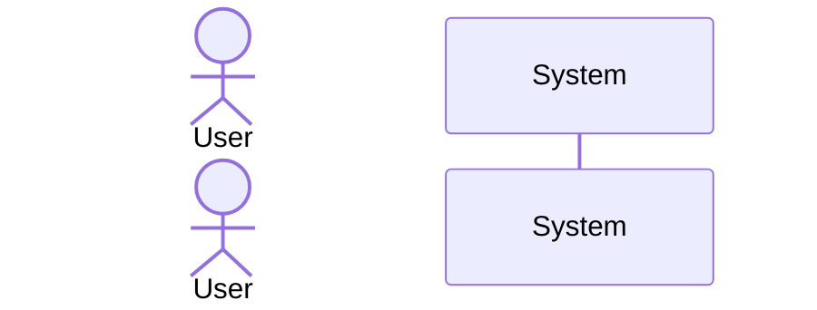

### 1.2 Activation Boxes

An entity is "active" (shown as a thin rectangle on its lifeline) whenever it's: sending a message, receiving a message, executing the requested action, or waiting for a response.

Two ways to show this:
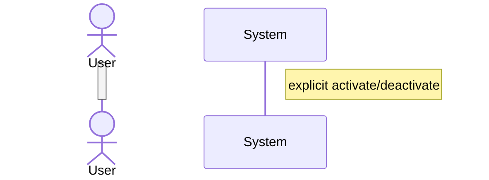
Or the shortcut — append `+` to a message to activate the **receiver**, `-` to a reply to deactivate the **sender of the reply**:
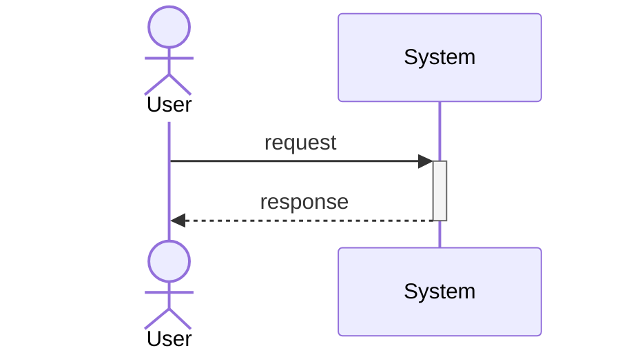
**This shortcut form is what you'll want under exam time pressure** — it's half the keystrokes and half the chances to forget a `deactivate`.

---

## 2. Messages — the arrow types that matter for this course

| Syntax | Meaning | When to use |
|---|---|---|
| `->>` | **Synchronous call** (solid line, filled arrowhead) | Sender makes a request and *waits* for the receiver to finish before continuing |
| `-->>` | **Synchronous reply** (dashed line, filled arrowhead) | The response to a `->>` call — **every synchronous message needs a matching reply** |
| `-)` | **Asynchronous message** (solid line, open arrowhead) | Sender fires the message and **continues immediately**, without waiting |
| `--)` | Asynchronous reply (rarely needed — async messages don't require a reply, but can send one if it makes sense) | Optional acknowledgement on an async flow |

**The single most common mark-losing mistake:** using a solid arrow (`->>`) where you mean a return/reply (should be `-->>`), or forgetting the reply arrow entirely for a synchronous call that clearly implies a response. **Every `->>` should have a matching `-->>` somewhere before that entity's activation ends**, unless it's genuinely fire-and-forget (async).

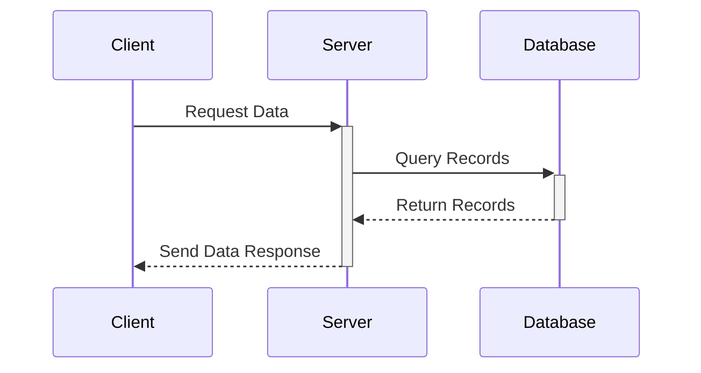

### 2.1 Self Loops

An entity can message itself — used for internal processing (validation, calculation) that's worth showing in the flow but doesn't involve another entity:
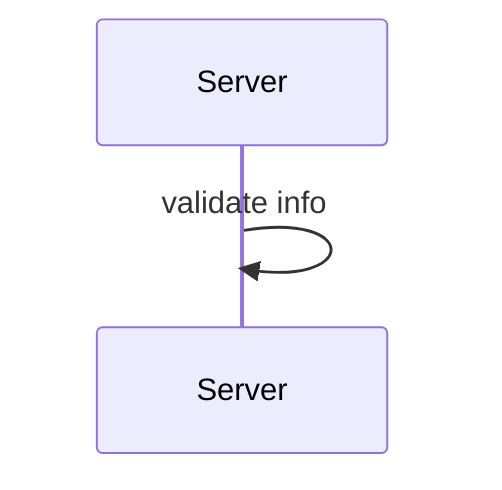
**Self loops don't need a reply — the reply is implied.** Don't draw a dashed self-arrow back; that's unnecessary.

### 2.2 Message Labels & Parameters

Write parameters when they're not obvious from the label alone:
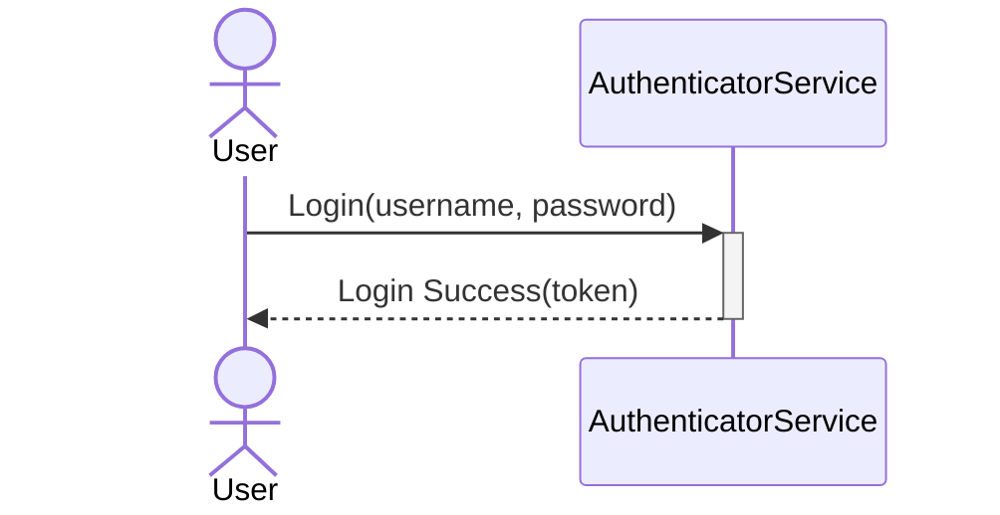
If a label like "Login" already implies what's sent, you can skip explicit parameters — use them for clarity, not as a mandatory box-ticking exercise.

---

## 3. Guards vs. Combined Fragments — know when to use which

**Guards** — a boolean condition in `[square brackets]` placed *before* a single message's label, used when only **one** message is conditional:
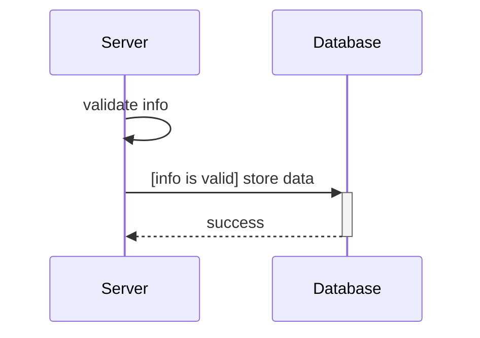
For a synchronous message, if the guard is false, **the reply is implied to also not happen**.

**Rule of thumb from your course guide:** if multiple messages share the *same* guard condition, use a combined fragment (`opt`/`alt`) instead of repeating the same guard on every line — a guard is for a single conditional message, a combined fragment is for a conditional *block*.

---

## 4. Combined Fragments

### 4.1 `opt` — Optional (if, no else)

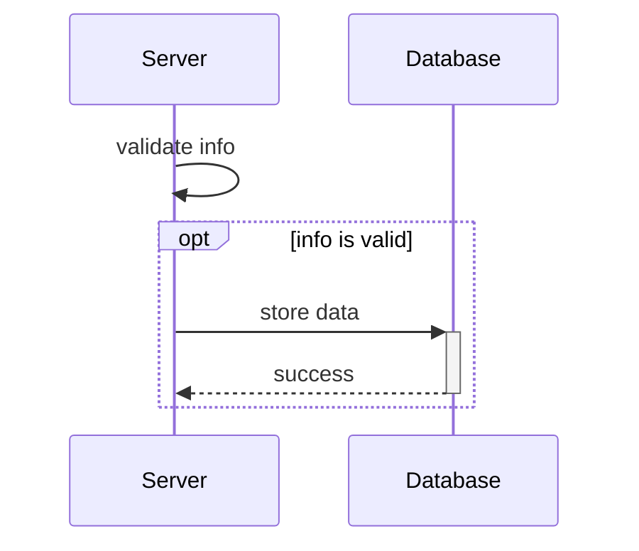

### 4.2 `alt` — Alternatives (if/else if/else)

Each branch after the first needs its own guard label; the **last branch doesn't require one** (it's treated as the `else`), though you can add one for readability:
```mermaid
sequenceDiagram
    actor User
    participant Application
    participant PaymentService
    participant InventoryService
    User->>+Application: Place Order
    Application->>+PaymentService: Process Payment
    alt Payment Successful
        PaymentService-->>-Application: Payment Acknowledged
        Application->>+InventoryService: Deduct Item
        InventoryService-->>-Application: Item Deducted
        Application-->>User: Order Confirmed
    else Payment Failed
        PaymentService-->>-Application: Payment Declined
        Application-->>User: Order Failed: Payment Issue
    end
```

### 4.3 `par` — Parallel (concurrent actions)

Two or more sections happening **at the same time** — no guard needed, since it's not conditional, just concurrent:
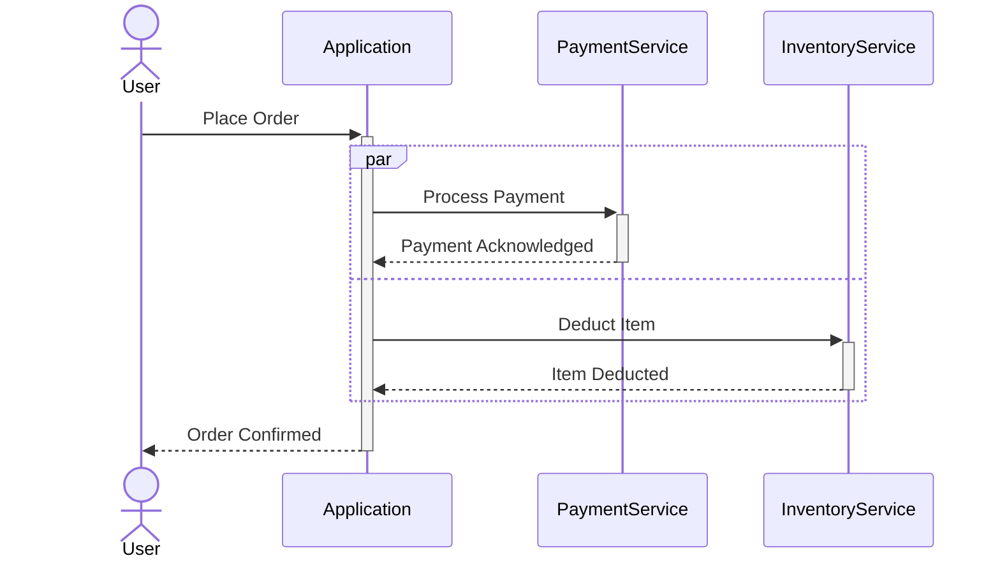
`par` blocks can be **nested** (a section inside a `par` can itself contain another `par`) — useful if a parallel branch triggers its own set of concurrent sub-actions.

### 4.4 `loop` — Repeated actions

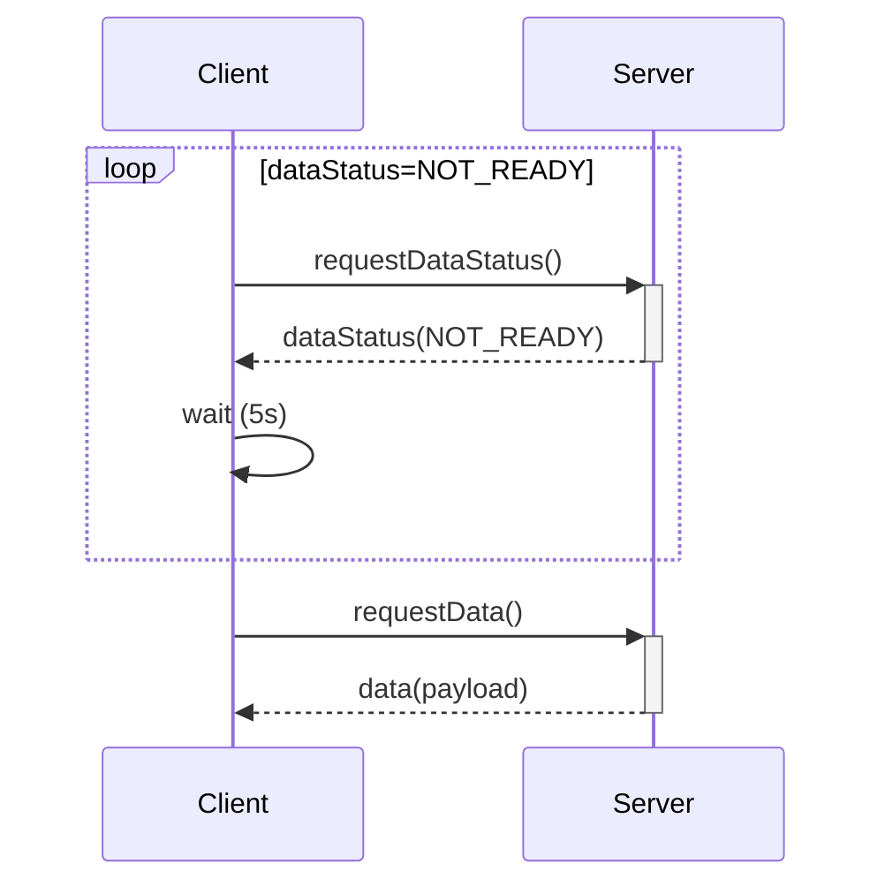
Label the loop with the condition being checked, not just "loop."

### 4.5 `break` — Termination of the current flow (usually models an exception)

The messages inside `break` run **instead of** the rest of the enclosing fragment/diagram — this is the mermaid equivalent of an early-return/exception path.

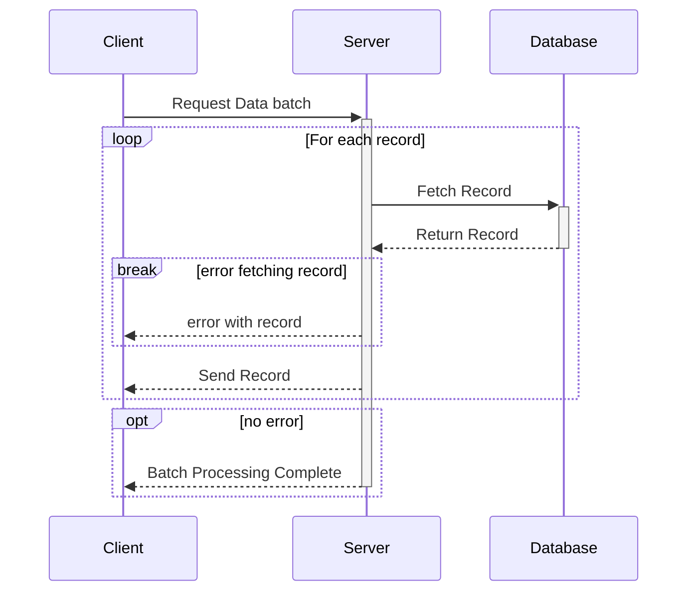
**Subtle but important, straight from your course guide:** `break` only breaks out of its **immediately enclosing fragment** (here, the `loop`) — it does *not* automatically prevent code *outside* that fragment from running. That's why the final "Batch Processing Complete" message needs its own `opt no error` wrapper — without it, that success message would still fire even after a `break` fired inside the loop above it. **This exact pattern (a `break` inside a `loop`, needing a separate `opt` to guard whatever comes after) is a realistic exam trap.**

---

## 5. Notes, Line Breaks, and the "end" Gotcha

**Notes** — annotate the diagram without representing an actual message:
```
Note right of System: some annotation
Note over Alice,John: a note spanning two participants
```

**Line breaks** — use `<br/>` inside a message or note to force a line break.

**The "end" collision (a genuine, easy-to-hit bug):** the literal word `end` can break the mermaid parser, because `end` is also a keyword closing fragments. If you need the word "end" in a message/note (e.g. "reached end of stream"), wrap it in brackets/parens/quotes: `(end)`, `[end]`, `{end}`, or `"end"`.

**Comments:** `%%` on its own line — ignored by the parser, useful for noting your own reasoning while drafting under exam time pressure, then deleting before submission if needed.

---

## 6. Full Arrow Reference (from the general mermaid docs — know these exist, but the four in Section 2 cover ~95% of what this course actually uses)

| Syntax | Description |
|---|---|
| `->` | Solid line, no arrowhead |
| `-->` | Dotted line, no arrowhead |
| `->>` | Solid line, arrowhead (**sync call**) |
| `-->>` | Dotted line, arrowhead (**sync reply**) |
| `-x` | Solid line, cross at end (failed/lost message) |
| `--x` | Dotted line, cross at end |
| `-)` | Solid line, open arrow (**async**) |
| `--)` | Dotted line, open arrow (async reply) |

> Likely **out of scope for this course** (present in the general mermaid docs, not mentioned in your own sequence diagram guide): `critical`/`option` regions, actor `create`/`destroy` directives, `rect` background highlighting, bidirectional arrows (`<<->>`). If your lecture slides show any of these, trust the slides over this note — but don't spend exam study time on them speculatively.

---

## 7. Worked Example — Full Process, Start to Finish

**Scenario:** "An instructor adds a new assessment via the web app. The backend validates the input. If invalid, it returns an error. If valid, it saves the assessment to the database and asynchronously emails all enrolled students."

**Step 1 — participants:** Instructor (actor), Web Application, Backend API, Database, Email Service.

**Step 2 — triggering call:** Instructor → Web Application.

**Step 3 — walk the scenario:**
```mermaid
sequenceDiagram
    actor Instructor
    participant WebApp as Web Application
    participant API as Backend API
    participant DB as Database
    participant Email as Email Service

    Instructor->>+WebApp: Enter details & click "Add Assessment"
    WebApp->>+API: POST /add-assessment(assessment)
    API->>API: validate input

    alt input is invalid
        API-->>WebApp: 400 Bad Request
        WebApp-->>-Instructor: Show error message
    else input is valid
        API->>+DB: saveAssessment(assessment)
        DB-->>-API: confirm save
        API-->>WebApp: 201 Created
        WebApp-->>-Instructor: Show success notification
        API-)Email: notifyEnrolledStudents(assessment)
    end
    deactivate API
```

**Reasoning behind each choice (this is the transferable process, not just this one example):**
- `API->>API: validate input` is a self-loop — internal processing worth showing, no other entity involved, no reply needed.
- The `alt` covers the two branches the scenario explicitly describes ("if invalid... if valid...") — each gets its own guard label in plain English matching the scenario's own wording.
- The email notification is `-)` (async, open arrowhead), **not** `->>`, because the scenario says the instructor's flow completes (success notification shown) independent of whether/when the email actually sends — this is exactly the async-vs-sync distinction from Weeks 4–5's Asynchronous Design section: does the caller need to wait for this to finish before continuing? No → async.
- Activation (`+`/`-`) is applied consistently: `WebApp` and `API` stay "active" for the duration of their involvement, deactivating only once their part of the flow is genuinely done — note `API` needs an explicit final `deactivate API`, since inside the `alt` branches it never got a `-` on a reply arrow back to itself (both branches' final replies deactivate `WebApp`, not `API`).

---

## 8. Common Mistakes Checklist (run through this before submitting any diagram)

- [ ] Every `->>` (sync call) has a matching `-->>` (sync reply) — unless it's genuinely async (`-)`).
- [ ] Solid vs. dashed arrows aren't swapped (calls solid, replies dashed).
- [ ] Self-loops don't have an unnecessary reply arrow.
- [ ] `alt`/`opt`/`loop` blocks are labelled with the actual condition, in the scenario's own terms — not left blank or generic.
- [ ] A `break` inside a `loop`/fragment is checked for whether code *after* that fragment needs its own `opt` guard to avoid running unconditionally.
- [ ] Entity names match your C4 Container diagram, if both are required by the same question.
- [ ] Abstraction level is consistent — not dropping to individual field getters, not collapsing the whole scenario into one arrow.
- [ ] The literal word "end" (if it appears anywhere in a message/note) is wrapped in brackets/parens/quotes.
- [ ] Lifelines ordered left-to-right by first activation, matching the order entities are introduced in the scenario.

---

## 9. Practice Prompts (do these now, don't just read them)

Set a 6–8 minute timer per prompt and draw the diagram from scratch — no looking back at Section 7 until you're done.

1. A user searches for a product. The search service checks a cache first; on a cache miss, it queries the database and populates the cache before returning results.
2. A user submits a support ticket. The system validates the ticket fields. If invalid, show an error. If valid, save the ticket **and**, in parallel, notify the assigned support agent and log the ticket to an analytics service.
3. A batch job processes a list of pending orders. For each order, it checks stock; if stock is unavailable for a given order, that order is marked failed and the loop continues to the next order (rather than terminating the whole batch) — model this without using `break` for the per-order failure (think about why `break` would be the *wrong* choice here, given what you just learned about what `break` actually does to the enclosing flow).

Prompt 3 is deliberately testing whether you understand `break` well enough to know when *not* to use it — if every failed order used `break`, it would end processing of the *entire loop*, not just skip to the next order, which contradicts "the loop continues to the next order." The correct tool there is a guard/`opt` inside the loop body, not `break`.
